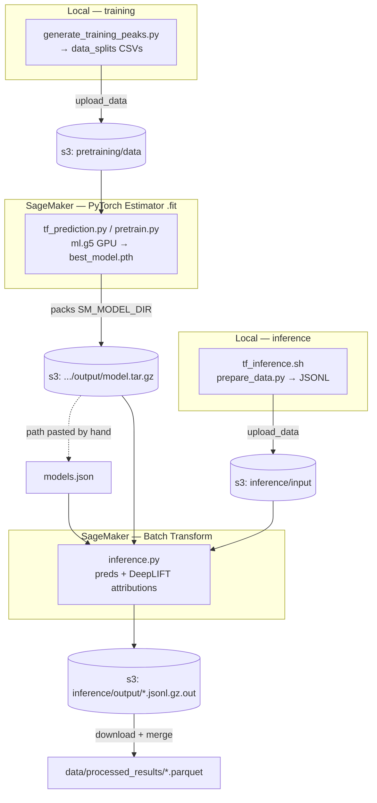

# TF Binding Prediction

## Setup

### Environment Installation

From the base directory, create the conda environment:

```bash
conda env create -f environment.yml
```

Activate the environment

```bash
conda activate pterodactyl
```

Install the Pterodactyl package:

```bash
pip install --no-deps -e .
```

Configure AWS credentials:

```bash
aws configure
```

## Finetuning

To finetune a model for a specific transcription factor:

1. Navigate to the training directory:
   ```bash
   cd src/training
   ```

2. Ensure your conda environment is activated:
   ```bash
   conda activate pterodactyl
   ```

3. Run the finetuning script with the desired TF and cell line:
   ```bash
   python tf_finetuning.py --tf_name AR --cell_line 22Rv1
   ```

This process takes anywhere from a couple hours to days depending on the amount of training cell lines. You can monitor progress in SageMaker training at [AWS SageMaker Console](https://016114370410-4y4js2yi.us-west-2.console.aws.amazon.com/sagemaker/home?region=us-west-2#/jobs).

## Inference

To run inference with your finetuned models:

1. Navigate to the inference directory:
   ```bash
   cd src/inference
   ```

2. Ensure your desired model is listed in `models.json`. Example:
   ```json
   {
     "FOXA1": "s3://tf-binding-sites/finetuning/results/output/FOXA1-22Rv1-2025-02-15-18-14-22-064/output/model.tar.gz",
     "HOXB13": "s3://tf-binding-sites/finetuning/results/output/HOXB13-22Rv1-2025-02-18-23-29-14-654/output/model.tar.gz"
   }
   ```
   
   Note: The paths contain the SageMaker training job names (e.g., `FOXA1-22Rv1-2025-02-15-18-14-22-064`).

3. Run inference (recommend using `screen` or `nohup` as this will take several hours):
   ```bash
   bash tf_inference.sh --atac_dir /data1/datasets_1/human_prostate_PDX/processed/ATAC_merge/LuCaP_145_1 --models FOXA1,HOXB13 --parallel
   ```


   This will output a parquet file in `data/processed_results` which we can use for downstream analysis (some example scripts can be found in `src/inference/analysis`)


#### to add new cell lines to training


## SageMaker's Role

SageMaker is the **cloud GPU backend**. Local machines only orchestrate: prep data → upload to S3 → launch job → download results. Two modes: **training** (PyTorch Estimator jobs) and **inference** (Batch Transform jobs — **no real-time endpoints**). All jobs share bucket `s3://tf-binding-sites`, role `arn:aws:iam::016114370410:role/tf-binding-sites`, region `us-west-2`. No custom Dockerfile/ECR image — uses AWS-managed PyTorch Deep Learning Containers auto-selected from `framework_version`/`py_version`/`instance_type`.

### When it's called

| Trigger (local) | SageMaker API | Instance | S3 output |
|---|---|---|---|
| `src/training/tf_finetuning.py` | `PyTorch(...).fit()` | `ml.g5.16xlarge` | `finetuning/results/output/` |
| `src/training/pretraining.py` | `PyTorch(...).fit()` | 3× `ml.g5.12xlarge` | `pretraining/output/` |
| `src/training/contrasting.py` | `PyTorch(...).fit()` | `ml.g5.16xlarge` | `finetuning/results/output/` |
| `src/inference/aws_inference.py` | `PyTorchModel(...).transformer().transform()` | `ml.g5.2xlarge` | `inference/output/<job>/` |

No live endpoints. Training is async (`wait=False`); inference is Batch Transform.

### Training

- Generate peaks locally → `Session().upload_data()` CSVs to `s3://tf-binding-sites/pretraining/data`.
- `estimator.fit()` launches the job; hyperparameters (`learning-rate`, `train-file`, `valid-file`) passed inline.
- **In-container entry point** `tf_prediction.py` (or `pretrain.py`) runs on SageMaker: reads `SM_CHANNEL_TRAINING`, loads `pretrained_weights.pth`, finetunes DeepSeq, writes `best_model.pth` to `SM_MODEL_DIR`.
- SageMaker packs `SM_MODEL_DIR` into **`model.tar.gz`** at `finetuning/results/output/<job-name>/output/`.
- **Handoff is manual:** the artifact stays in S3; its path (embedding the timestamped job name) is pasted by hand into `src/inference/models.json` (~47 models registered). Progress watched in the SageMaker console.
- Notebook variants of the same flow exist: `pretrain.ipynb`, `pretrain_distributed.ipynb` (the latter uses `pytorchddp` distribution + TensorBoard config).

### Inference

- Driven by `src/inference/tf_inference.sh`: builds JSONL payloads locally (`generate_training_peaks.py` + `prepare_data.py` via `qsub`), then calls `aws_inference.py`.
- `aws_inference.py`: uploads JSONL to `inference/input/<job>` → resolves `model.tar.gz` from `models.json` → `PyTorchModel` + `.transformer()` → `transformer.transform()` (Batch Transform).
- **In-container entry point** `src/inference/scripts/inference.py` implements the SageMaker serving contract (`model_fn`/`input_fn`/`predict_fn`/`output_fn`); computes predictions **and DeepLIFT attributions** (Captum) + a `linear_512` embedding.
- Output written to `inference/output/<job>/` as `.jsonl.gz.out`.
- `contrasting_inference.py` is a Python driver for contrastive-model inference that shells out to `aws_inference.py`. A byte-identical copy of `aws_inference.py` also lives under `src/analysis/interpretability/.../mm_model_inference/`.
- Separate from SageMaker: `src/utils/aws_sync.sh` uses the plain AWS CLI (`aws s3 sync`) to push pileup data to S3.

### What we send / receive

**Sent →** training/validation CSVs (train); gzipped JSONL sequence+ATAC payloads (infer); job config + hyperparameters; the trained `model.tar.gz` as the inference model.

**Received ←**
- Training: `model.tar.gz` (contains `best_model.pth`) — left in S3, not auto-downloaded.
- Inference: `.jsonl.gz.out` files → downloaded to `data/jsonl_output/` → merged (polars) → **parquet** in `data/processed_results/`. Columns: `chr, start, end, cell_line, targets, predicted, probabilities, linear_512_output, attributions`.

### Key coordinates

- Bucket: `tf-binding-sites`
- Role: `arn:aws:iam::016114370410:role/tf-binding-sites`
- Prefixes: `pretraining/data` (train in), `finetuning/results/output` + `pretraining/output` (models out), `inference/input`, `inference/output`
- Registry: `src/inference/models.json`

### Diagram



---
*Note: `src/training/pretraining.py:99` references an undefined `distribution` variable — that orchestrator would raise `NameError` as written; the working distributed logic lives in `tf_prediction.py`'s runtime detection.*
