# Interpretability Analysis Pipeline

Seqlet calling and motif analysis of TF-binding model attributions.

## Pipeline

**`utils/base.py`**
- Purpose: combine JSONL model-output shards into one processed parquet.
- In: `data/jsonl_output/{model}-{sample}/*.jsonl.gz.out`
- Out: `data/processed_results/{model}_{sample}_processed.parquet`

**`call_seqlets.py`** (main)
- Purpose: unified seqlet pipeline — join windows to ground-truth BED, call seqlets, export pos/neg seqlets + FASTA, PWM-score, plot attribution+ATAC logos, and shell out to `levenshtein.py` and `posthoc.R`.
- In: processed parquet, `motifs/{model}.jaspar`, ground-truth BED, genome FASTA.
- Out (under `output/{date}_{model}_{sample}/`): `{model}_{sample}_{subset}_seqlets.csv`, `positive_seqlets.csv`/`.fa`, `negative_seqlets.csv`, `..._pwm_scored.csv`, `lev_pwm.csv`, `rank{i}_..._attributions_with_ATAC.pdf`.

**`levenshtein.py`**
- Purpose: IUPAC-aware Levenshtein score of seqlets vs a JASPAR PWM (CLI).
- In: `--jaspar`, `--seqlets`, `--output`, `--min-score`.
- Out: matches CSV at `--output` (`lev_pwm.csv`).

**`posthoc.R`**
- Purpose: post-hoc seqlet stats and plots.
- In (argv `<min_seqlet> <receptor> <dir>`): `lev_pwm.csv`, `positive_seqlets.csv`, `negative_seqlets.csv`.
- Out: `all_seqlets.csv`, `abundant_candidate_motifs.csv`, `seqlets_with_PWM.csv`, `attr_volc.png`, `pos_volc.png`, `common_motifs.png`, `top_attrs.png`.

**`attr_matrices.py`**
- Purpose: reshape attributions into per-position pos/neg/ATAC matrices for high-confidence windows.
- In: `data/processed_results/{MODEL}_{CELL_LINE}_processed.parquet`
- Out: `data/attribution_matrices/{MODEL}_{CELL_LINE}_attrs.parquet` (feeds `attr_posthoc_analyses/`).

## Helpers (`utils/`)

**`parquet_to_csv_gz.py`**
- Purpose: stream a processed parquet to `.csv.gz`, expanding nested attributions into 5 channel columns.
- In: positional parquet + flags (`-o`, `--batch-size`, `--threads`, `--level`, `--limit`).
- Out: `.csv.gz`.

**`find_samples.sh`**
- Purpose: list samples that have both a processed parquet and a merged ground-truth BED.
- In: `$1` MODEL.
- Out: stdout.

Downstream attribution-matrix analyses live in `attr_posthoc_analyses/` (see its README).

## Pipeline Flowchart

```mermaid
flowchart LR
    %% External / upstream inputs
    jsonl[/"data/jsonl_output/&lcub;model&rcub;-&lcub;sample&rcub;/*.jsonl.gz.out"/]:::ext
    jaspar[/"motifs/&lcub;model&rcub;.jaspar"/]:::ext
    bed[/"ground-truth &lcub;sample&rcub;_&lcub;model&rcub;_merged.bed"/]:::ext
    fasta[/"genome FASTA (pysam)"/]:::ext

    %% Scripts in this folder
    base(["utils/base.py"]):::script
    callseq(["call_seqlets.py (main)"]):::script
    lev(["levenshtein.py"]):::script
    posthoc(["posthoc.R"]):::script
    attrmat(["attr_matrices.py"]):::script

    %% Intermediate / output data
    parquet["data/processed_results/&lcub;model&rcub;_&lcub;sample&rcub;_processed.parquet"]:::data
    seqletcsv["output/&lcub;date&rcub;_&lcub;model&rcub;_&lcub;sample&rcub;/*seqlets.csv, *.fa"]:::data
    pwmcsv["..._pwm_scored.csv"]:::data
    pdfs["rank&lcub;i&rcub;_..._attributions_with_ATAC.pdf"]:::data
    levcsv["lev_pwm.csv"]:::data
    finalcsvs["all_seqlets.csv, seqlets_with_PWM.csv, abundant_candidate_motifs.csv"]:::data
    pngs["attr_volc.png, pos_volc.png, common_motifs.png, top_attrs.png"]:::data
    attrparquet["data/attribution_matrices/&lcub;model&rcub;_&lcub;sample&rcub;_attrs.parquet"]:::data
    downstream[/"attr_posthoc_analyses/"/]:::ext

    %% base.py: JSONL -> parquet
    jsonl --> base --> parquet

    %% Main path: call_seqlets.py
    parquet --> callseq
    jaspar --> callseq
    bed --> callseq
    fasta --> callseq
    callseq --> seqletcsv
    callseq --> pwmcsv
    callseq --> pdfs

    %% Scoring + post-hoc (control-flow handoffs from call_seqlets.py)
    callseq -. "shells out" .-> lev
    seqletcsv --> lev
    jaspar --> lev
    lev --> levcsv
    callseq -. "shells out" .-> posthoc
    seqletcsv --> posthoc
    levcsv --> posthoc
    posthoc --> finalcsvs
    posthoc --> pngs

    %% Attribution matrices -> downstream analyses
    parquet --> attrmat --> attrparquet
    attrparquet -.-> downstream

    classDef script fill:#dbeafe,stroke:#1e3a8a,stroke-width:2px,color:#0b1d51;
    classDef data fill:#fef3c7,stroke:#92400e,color:#451a03;
    classDef ext fill:#f3f4f6,stroke:#374151,stroke-dasharray:5 4,color:#111827;
```

**Legend**

- Solid blue rounded box — script in this folder
- Yellow box — intermediate or output data file
- Dashed grey box — upstream/external input or downstream folder
- Dashed edge — control-flow (not data) handoff
