# Interpretability Analysis Pipeline

This directory contains scripts for analyzing and interpreting sequence motifs. Follow these steps in order:

1. **Generate Base Data** 
   - Run `interpretability.ipynb` notebook
   - This extracts seqlets (sequence segments) and their attribution scores from the model
   - Runs `python levenstein.py --jaspar motif.jaspar --seqlets positive_seqlets.csv --output lev_pwm.csv`
   - Computes Levenshtein distances between seqlets and known motif PWMs from JASPAR database
   - Outputs similarity scores to `lev_pwm.csv`

2. **Generate Visualization Plots**
   - Run `posthoc.R`
   - Creates various plots analyzing the relationships between:
     - Attribution scores
     - PWM similarities 
     - Seqlet frequencies
   - Outputs plots as PNG files for visualization

## Pipeline Flowchart

A high-level view of how the scripts in this folder hand off data to each
other. [plot_with_atac.py](plot_with_atac.py) is the current production entry
point (combines attributions with ATAC accessibility); the
[interpretability.py](interpretability.py) → external `levenstein.py` →
[posthoc.R](posthoc.R) chain is the older Levenshtein/PWM-based path. The
`interpretability_with_atac*` variants and the hidden `.20260422_plotWithATAC.py`
snapshot are earlier exploratory drafts superseded by
[plot_with_atac.py](plot_with_atac.py).

```mermaid
flowchart LR
    %% External / upstream inputs
    jsonl[/"data/jsonl_output/&lcub;model&rcub;-&lcub;sample&rcub;/*.jsonl.gz.out"/]:::ext
    jaspar[/"motifs/&lcub;model&rcub;.jaspar"/]:::ext
    bed[/"data/transcription_factors/.../&lcub;sample&rcub;_&lcub;model&rcub;_merged.bed"/]:::ext
    atac[/"merged_cell_lines/&lcub;cell_line&rcub;/pileup_mod/*.pileup.gz"/]:::ext
    topsamples[/"top_samples.txt (optional)"/]:::ext
    levenstein(["levenstein.py (external: src/inference/interpretability/)"]):::extscript

    %% Scripts in this folder
    base(["base.py"]):::script
    interp(["interpretability.py"]):::script
    plot(["plot_with_atac.py (main)"]):::script
    posthoc(["posthoc.R"]):::script
    nb(["20260504_seqlet_playground.ipynb"]):::script

    %% Intermediate / output data
    parquet["data/processed_results/&lcub;model&rcub;_&lcub;sample&rcub;_processed.parquet"]:::data
    posseq["output/&lcub;model&rcub;_&lcub;sample&rcub;/positive_seqlets.csv"]:::data
    negseq["output/&lcub;model&rcub;_&lcub;sample&rcub;/negative_seqlets.csv"]:::data
    fa["output/&lcub;model&rcub;_&lcub;sample&rcub;/positive_seqlets.fa"]:::data
    levcsv["lev_pwm.csv"]:::data
    seqletcsv["&lcub;model&rcub;_&lcub;sample&rcub;_&lcub;subset&rcub;_seqlets.csv"]:::data
    attrspkl["&lcub;model&rcub;_&lcub;sample&rcub;_&lcub;subset&rcub;_attrs.pkl.gz (cache)"]:::data
    pdfs["plots/&lcub;date&rcub;_&lcub;model&rcub;_&lcub;sample&rcub;_&lcub;subset&rcub;_&lcub;ctx&rcub;bp/rank&lcub;i&rcub;_*.pdf"]:::data
    finalcsvs["all_seqlets.csv, seqlets_with_PWM.csv, abundant_candidate_motifs.csv"]:::data
    pngs["attr_volc.png, pos_volc.png, common_motifs.png, top_attrs.png"]:::data

    %% Legacy / superseded
    legacy["Legacy / superseded:<br/>interpretability_with_atac.py<br/>interpretability_with_atac_wJohnson.py<br/>.20260422_plotWithATAC.py"]:::legacy

    %% base.py: JSONL -> parquet
    jsonl --> base --> parquet

    %% Production path: plot_with_atac.py
    parquet --> plot
    jaspar --> plot
    bed --> plot
    atac --> plot
    topsamples -.optional.-> plot
    plot --> seqletcsv
    plot --> attrspkl
    plot --> pdfs
    attrspkl -.cached re-read.-> plot

    %% Legacy path: interpretability.py -> levenstein.py -> posthoc.R
    parquet --> interp
    jaspar --> interp
    bed --> interp
    interp --> posseq
    interp --> negseq
    interp --> fa
    posseq --> levenstein
    jaspar --> levenstein
    levenstein --> levcsv
    posseq --> posthoc
    negseq --> posthoc
    levcsv --> posthoc
    posthoc --> finalcsvs
    posthoc --> pngs
    interp -. "os.system call" .-> posthoc

    %% Playground notebook
    parquet --> nb

    %% Legacy supersession
    legacy -.superseded by.-> plot

    classDef script fill:#dbeafe,stroke:#1e3a8a,stroke-width:2px,color:#0b1d51;
    classDef extscript fill:#dbeafe,stroke:#1e3a8a,stroke-width:2px,stroke-dasharray:5 4,color:#0b1d51;
    classDef data fill:#fef3c7,stroke:#92400e,color:#451a03;
    classDef ext fill:#f3f4f6,stroke:#374151,stroke-dasharray:5 4,color:#111827;
    classDef legacy fill:#fee2e2,stroke:#991b1b,stroke-dasharray:3 3,color:#450a0a;
```

**Legend**

- Solid blue rounded box — script in this folder
- Dashed blue rounded box — script outside this folder (`levenstein.py`)
- Yellow box — intermediate or output data file
- Dashed grey box — upstream/external input file
- Dashed red box — legacy/exploratory scripts superseded by the production path
- Dashed edge — optional input, cache reload, control-flow (not data) handoff,
  or supersession relationship
